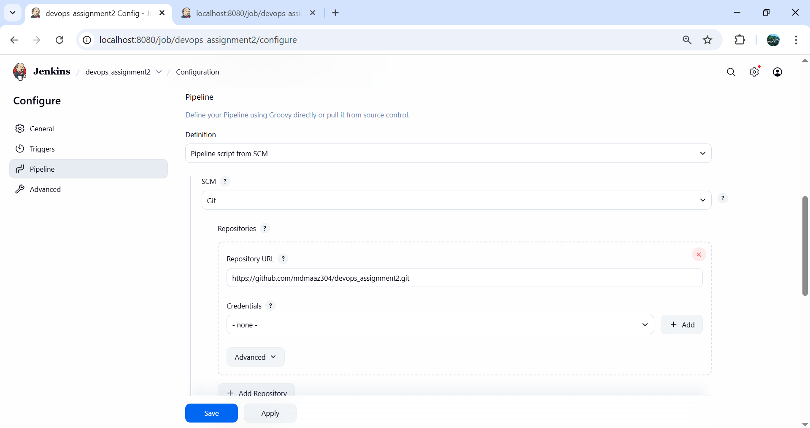
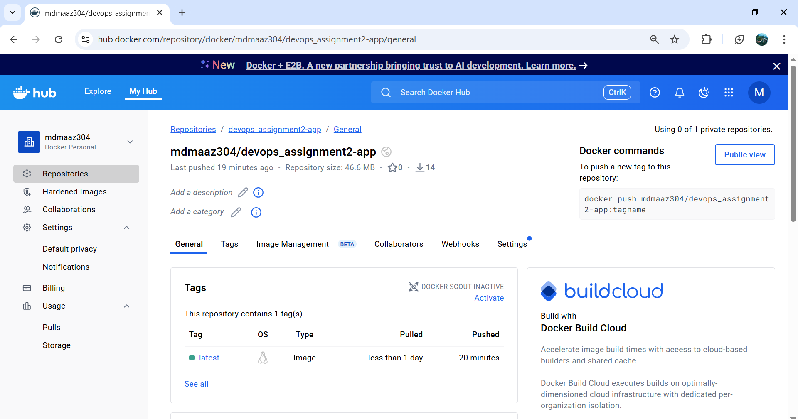
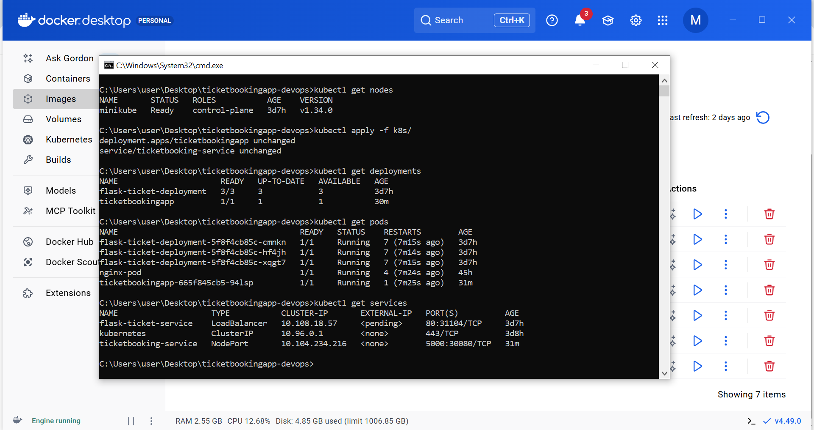
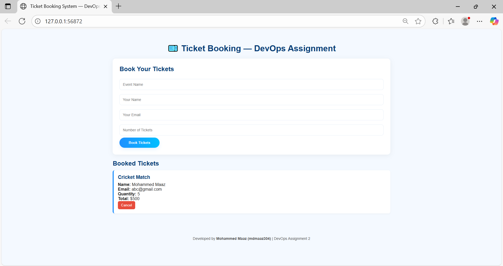

# 🎟️ TicketEase – Automated Ticket Booking Platform with CI/CD Pipeline  

  
  
  
  
  

A fully automated **Flask-based ticket booking application**, demonstrating a complete **DevOps workflow** integrating **Docker**, **Jenkins**, and **Kubernetes (Minikube)**.  

---

## 🌟 Overview  

**TicketEase** is a sample production-ready ticket booking system designed to demonstrate automation in software delivery using DevOps tools.  
The project showcases:  
- Docker-based **containerization** of a Flask application  
- A **CI/CD pipeline** built with Jenkins  
- **Kubernetes**-based orchestration and deployment  
- Seamless image publishing on **Docker Hub**  

---

## ✨ Features  

- **Flask Web Server:** Lightweight and easy to deploy Python backend  
- **Dockerized Environment:** Simplifies deployment and dependency management  
- **Jenkins Automation:** Push-button build → test → deploy workflow  
- **Kubernetes Deployment:** Managed rollout and scaling with `deployment.yaml`  
- **Health Checks:** Ensures application uptime and reliability  
- **NodePort Exposure:** Access web app via Minikube service URL  

---

## 🏗️ System Architecture  

      ┌──────────────────────────┐
      │     GitHub Repo          │
      │ mdmaaz304/devops_assignment2 │
      └───────────┬──────────────┘
                  │
                  ▼
      ┌──────────────────────────┐
      │        Jenkins           │
      │     CI/CD Pipeline       │
      └───────────┬──────────────┘
                  │
                  ▼
      ┌──────────────────────────┐
      │       Docker Hub         │
      │  (TicketEase Image)      │
      └───────────┬──────────────┘
                  │
                  ▼
      ┌──────────────────────────┐
      │   Kubernetes Cluster     │
      │ (Pods + Service + Load)  │
      └───────────┬──────────────┘
                  │
                  ▼
      ┌──────────────────────────┐
      │     End Users / Clients  │
      │ (Access via NodePort)    │
      └──────────────────────────┘

---

## 📁 Project Structure  

devops_assignment2/
│
├── app/ # Flask web application source
│ ├── static/ # CSS, JS, images
│ ├── templates/ # HTML templates
│ ├── app.py # Main entry point
│ └── requirements.txt # Dependencies
│
├── Dockerfile # Docker build instructions
├── Jenkinsfile # Jenkins CI/CD definition
├── .gitignore # Ignored files
│
├── k8s/
│ ├── deployment.yaml # Kubernetes deployment
│ └── service.yaml # Kubernetes service
│
├── screenshots/ # Documentation screenshots
└── README.md # Project documentation

---

## 📸 Screenshots  

| Description | Screenshot |
|--------------|-------------|
| Jenkins Pipeline |  |
| Docker Hub Repository |  |
| Kubernetes Pods & Service |  |
| TicketEase Web Interface |  |

*(Update the filenames according to your screenshots folder.)*

---

## 🐳 Docker Deployment  

bash
# 🧱 Build Docker Image
docker build -t mdmaaz304/devops_assignment2-app:latest .

# 🚀 Run Locally
docker run -d -p 5000:5000 mdmaaz304/devops_assignment2-app:latest

##Push to Docker Hub

# 🏷️ Tag Docker Image
docker tag mdmaaz304/devops_assignment2-app:latest mdmaaz304/devops_assignment2-app:latest

# 🔑 Login to Docker Hub
docker login

# 📤 Push Image
docker push mdmaaz304/devops_assignment2-app:latest

##Kubernetes Deployment
# 🟢 Start Minikube
minikube start

# 📄 Apply Deployment and Service
kubectl apply -f k8s/

# 🔍 Check Status
kubectl get pods
kubectl get svc

# 🌐 Access Application
minikube service ticketbooking-service
 
## CI/CD pipeline flow
1️⃣ Code Checkout → Jenkins pulls from GitHub  
2️⃣ Docker Build → Jenkins builds image from Dockerfile  
3️⃣ Push → Jenkins uploads image to Docker Hub  
4️⃣ Deploy → Jenkins deploys via kubectl to Minikube  
5️⃣ Verify → Pods and Services running successfully

## Jenkins setup
1️⃣ Install Plugins → Docker Pipeline, Git, Kubernetes CLI  
2️⃣ Add Credentials → Docker Hub access token  
3️⃣ Create Pipeline → Link to your GitHub repository  
4️⃣ Run Job → Observe automated build, push, and deploy stages  

## Author
Author: Mohammed Maaz  
GitHub: https://github.com/mdmaaz304  
Docker Hub: https://hub.docker.com/u/mdmaaz304  

Contributions:
✔ Developed Flask application  
✔ Created Dockerfile and Jenkinsfile  
✔ Configured CI/CD automation using Jenkins  
✔ Deployed app to Kubernetes (Minikube)  
✔ Added project documentation and screenshots  

 